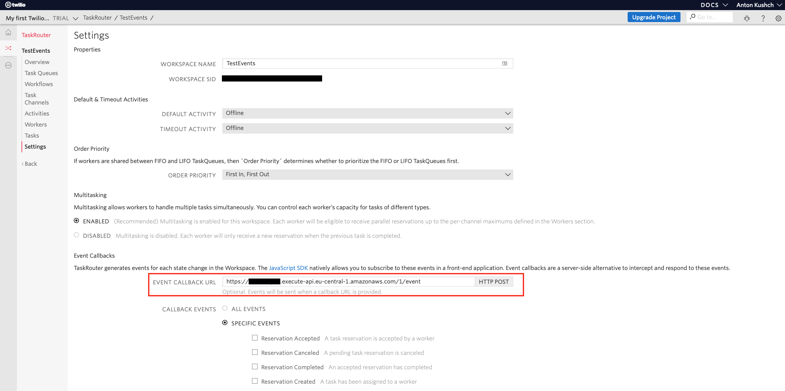

### Description
This project shows how events from Twilio TaskRouter can be forwarded to AWS Kinesis for futrher processing.

The project is built using Kotless (https://github.com/JetBrains/kotless) and Ktor DSL in particular (https://github.com/JetBrains/kotless/wiki/Ktor-DSL-Overview).

### Testing

To test the app you can start it with:
```
gradle local
```
There is a test request in [http/event_body.http](http/event_body.http). By configuring lambda URL in `prod` profile in `http/http-client.env.json` file you can also test the deployed lambda.
Local [AWS credentials configuration](https://docs.aws.amazon.com/sdk-for-java/v1/developer-guide/credentials.html) is needed for sending events to Kinesis stream or Localstack.

### Kotless initial setup

Before deploying first time you have to make initial kotless setup.
This includes:
1. Creating a user with Programmatic Access.
2. Creating an S3 bucket where the lambda code will be stored.
3. Configuring AWS credentials profile. 

It is important that profile name in AWS credentials configuration (normally in `~/.aws/credentials`) matches the profile name in the `build.gradle.kts`.

For example in `build.gradle.kts` file the profile name is `kotless`:
```
kotless {
    config {
        terraform {
            profile = "kotless"
            region = "eu-west-1"
    }
}
```
So in order to work AWS credentials configuration file should have a profile with name `kotless` and key/secret of the user created in the 1st step:
```
[kotless]
aws_access_key_id=%KEY_ID_VALUE%
aws_secret_access_key=%KEY_SECRET_VALUE%
```

Detailed step by step instructions on how to start with kotless can be found in the article [here.](https://hadihariri.com/2020/05/12/from-zero-to-lamda-with-kotless/)

### Deployment

To deploy the app run:
```
gradle deploy
```

Once the deployment successfully completed you will see in the output URL to the newly created lambda. Something like:
```
Apply complete! Resources: 1 added, 2 changed, 1 destroyed.

Outputs:

application_url = https://1234567890.execute-api.eu-central-1.amazonaws.com/1
```
Now you can put this URL into your TaskRouter Workspace configuration:


After this step you should start receiving events in the Kinesis stream configured in `Config.kt`.
```
aws kinesis get-records --shard-iterator="AAAAAAAAAAGXO..." --profile=kotless --region=eu-central-1
```
Output:
```
{
    "Records": [
        {
            "SequenceNumber": "49614242691330351028565080458513274682580511486675779586",
            "ApproximateArrivalTimestamp": "2021-01-13T22:19:48.342000+01:00",
            "Data": "SGVsbG8gS290bGVzcyE=",
            "PartitionKey": "worker.activity.update"
        }
    ],
    "NextShardIterator": "AAAAAAAAAAEqK...",
    "MillisBehindLatest": 0
}
```

### Why extensions.tf is needed?
The deployed lambda won't be able to put records into the kinesis stream unless you give it permission to.
Exactly for this purpose we need `extensions.tf`. The code in there attaches a policy to the lambda role created by kotless.
Most important part in there is Kinesis stream ARN. It is the ARN of the target stream.
```
"Resource": "arn:aws:kinesis:eu-central-1:121696724468:stream/TaskRouterEvents"
```


